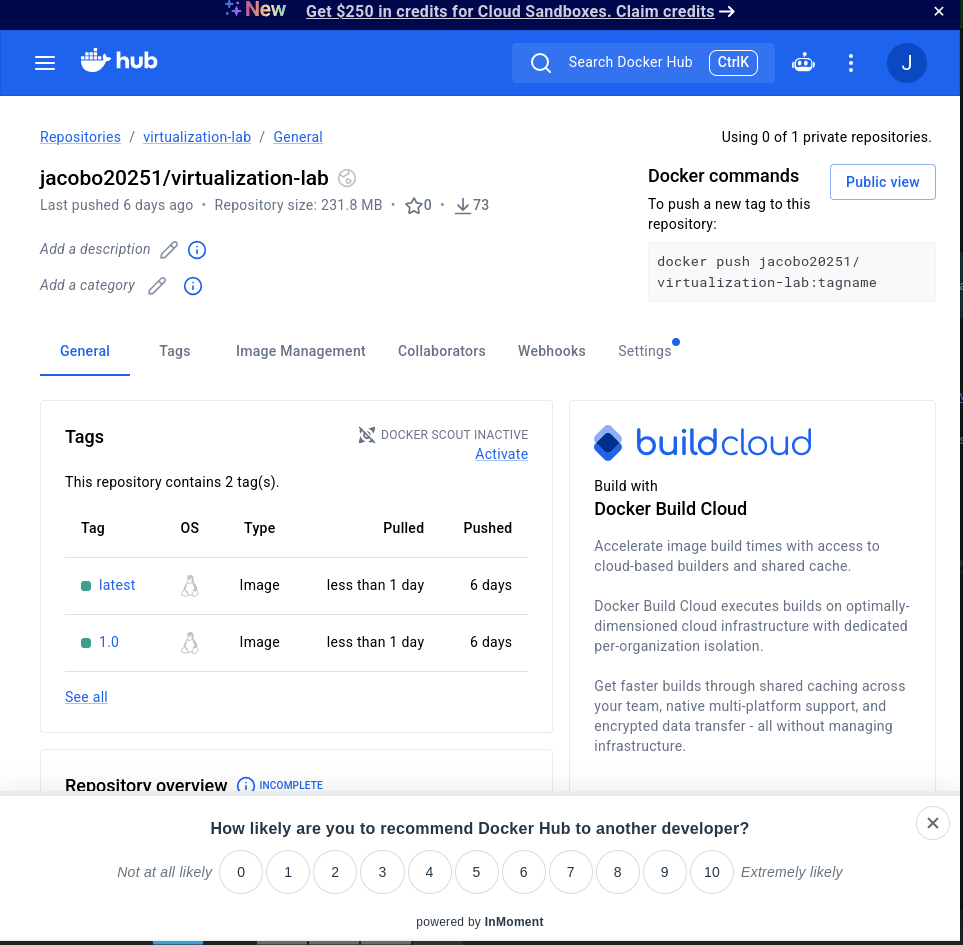
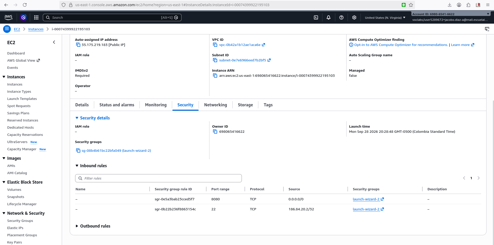

# Virtualization Lab — Spring Boot, Docker, Docker Hub y AWS EC2

Proyecto desarrollado para el laboratorio de virtualización y despliegue de aplicaciones.

El proyecto demuestra el proceso completo de:

- Desarrollo de una aplicación web con Spring Boot.
- Construcción y ejecución local.
- Contenerización mediante Docker.
- Ejecución mediante Docker Compose.
- Publicación de una imagen en Docker Hub.
- Despliegue de la aplicación en una instancia AWS EC2.
- Configuración de seguridad mediante AWS Security Groups.
- Análisis básico del modelo de despliegue y costos de infraestructura.

---

## 1. Arquitectura general

La arquitectura implementada es la siguiente:

```text
                         CLIENTE
                            |
                            | HTTP
                            v
                  +-------------------+
                  |     AWS EC2       |
                  |  Amazon Linux     |
                  +---------+---------+
                            |
                            | Puerto 8080
                            v
                  +-------------------+
                  |  Docker Engine    |
                  +---------+---------+
                            |
                            | 8080 -> 9000
                            v
                  +-------------------+
                  | Docker Container  |
                  | Spring Boot App   |
                  |      :9000        |
                  +-------------------+
```

### Responsabilidad de cada capa

- **Máquina virtual EC2:** proporciona recursos aislados de cómputo, memoria, almacenamiento y red, alquilados a través de AWS.
- **Contenedor Docker:** proporciona un entorno de ejecución portable que contiene la aplicación y sus dependencias.
- **Aplicación web Java:** recibe las solicitudes HTTP y proporciona la funcionalidad de la aplicación.
- **Security Group:** controla qué tráfico entrante puede llegar a la máquina virtual EC2.

---

## 2. Prerrequisitos

- Java 21 o superior
- Maven 3.9 o superior
- Docker Desktop con Docker Compose v2
- Cuenta de Docker Hub
- Cuenta de AWS con permisos para crear instancias EC2

---

## 3. Construcción y ejecución local

Clonar el repositorio y construir el proyecto:

```bash
git clone [COMPLETAR: URL de este repositorio]
cd virtualization-lab
mvn clean package
```

Ejecutar la aplicación:

```bash
java -jar target/*.jar
```

Por defecto, la aplicación escucha en el puerto **9000** (configurable mediante la variable de entorno `PORT`).

Verificar el endpoint:

```
http://localhost:9000/greeting?name=Pedro
```

Respuesta esperada:

```
Hello, Pedro!
```

---

## 4. Contenerización con Docker

Construir la imagen (reemplaza `<dockerhub-user>` por tu usuario de Docker Hub):

```bash
docker build -t <dockerhub-user>/virtualization-lab:1.0 .
```

Ejecutar un contenedor, mapeando el puerto interno a uno de la máquina local:

```bash
docker run -d \
  --name virtualization-lab-1 \
  -e PORT=9000 \
  -p 34000:9000 \
  <dockerhub-user>/virtualization-lab:1.0
```

Verificar:

```
http://localhost:34000/greeting?name=Container
```

### Evidencia de aislamiento entre contenedores

Se corrieron 3 instancias simultáneas de la misma imagen, cada una en un puerto distinto, confirmando que responden de manera independiente.


---

## 5. Entorno multi-contenedor con Docker Compose

El archivo `compose.yaml` define dos servicios: la aplicación web y una base de datos MongoDB, ambos en la misma red Docker.

Levantar el entorno:

```bash
docker compose up -d --build
```

Verificar los servicios:

```bash
docker compose ps
```

Probar la aplicación:

```
http://localhost:8087/greeting?name=Compose
```

El servicio `web` se comunica con `db` usando el nombre del servicio como hostname (`db`), gracias a la red interna que Docker Compose crea automáticamente. Nótese que la aplicación no persiste datos en MongoDB en esta etapa del laboratorio — el servicio `db` existe para demostrar el mecanismo de red multi-contenedor de Compose, no una integración funcional.


Detener el entorno conservando los datos:

```bash
docker compose down
```

---

## 6. Publicación en Docker Hub

```bash
docker login
docker tag <dockerhub-user>/virtualization-lab:1.0 <dockerhub-user>/virtualization-lab:latest
docker push <dockerhub-user>/virtualization-lab:1.0
docker push <dockerhub-user>/virtualization-lab:latest
```

**Repositorio en Docker Hub:** https://hub.docker.com/repository/docker/jacobo20251/virtualization-lab/general



---

## 7. Despliegue en AWS EC2

### Configuración del Security Group

- Puerto 22 (SSH): restringido únicamente a la IP pública propia.
- Puerto 8080 (aplicación): abierto para el tráfico necesario.



### Instalación y ejecución en la instancia

```bash
sudo yum update -y
sudo yum install -y docker
sudo service docker start
sudo usermod -a -G docker ec2-user
```

```bash
docker pull <dockerhub-user>/virtualization-lab:1.0

docker run -d \
  --name virtualization-lab \
  --restart unless-stopped \
  -e PORT=9000 \
  -p 8080:9000 \
  <dockerhub-user>/virtualization-lab:1.0
```

### Prueba del despliegue


---

## 8. Modelo de despliegue y análisis de costos

### Descripción del modelo

```text
Cliente
  |
  | HTTP request
  v
Máquina virtual EC2
  |
  v
Docker Engine
  |
  v
Contenedor de la aplicación Java
```

| Capa | Responsabilidad |
|---|---|
| Máquina virtual EC2 | Recursos aislados de cómputo, memoria, almacenamiento y red, alquilados por hora. |
| Contenedor Docker | Entorno de ejecución portable con la aplicación y sus dependencias. |
| Aplicación Java | Recibe las peticiones HTTP y da la funcionalidad de negocio. |
| Security Group | Controla qué tráfico entrante puede llegar a la máquina virtual. |

### Supuestos de carga de trabajo

La aplicación es muy liviana en cómputo (una operación aritmética simple por petición, sin persistencia real), por lo que el factor decisivo entre escenarios es la disponibilidad requerida, no la capacidad de CPU.

| Escenario | Peticiones/mes | Región | Tipo de instancia | N° instancias | Horas/mes | Almacenamiento EBS | Transferencia saliente estimada | Alta disponibilidad |
|---|---|---|---|---|---|---|---|---|
| Pequeña | 10,000 | us-east-1 | t3.micro | 1 | 730 (24/7) | 8 GiB gp3 | ~0.02 GB | No |
| Media | 100,000 | us-east-1 | t3.micro | 1 | 730 (24/7) | 8 GiB gp3 | ~0.2 GB | No |
| Grande | 1,000,000 | us-east-1 | t3.micro | 2 (redundancia) | 730 (24/7) c/u | 8 GiB gp3 c/u | ~2 GB | Sí |

*Supuesto de tamaño de respuesta: ~2 KB por petición JSON, usado para estimar la transferencia saliente.*

### Estimado de costos (AWS Pricing Calculator)

> **Nota:** los valores de esta tabla son un estimado de referencia calculado a partir del precio publicado de `t3.micro` en `us-east-1` ($0.0104/hora). La evidencia oficial requerida por el enunciado (captura/export de la AWS Pricing Calculator) debe generarse desde calculator.aws con estos mismos supuestos.


| Escenario | Peticiones/mes | Costo mensual estimado | Costo estimado por petición | Principales factores de costo |
|---|---|---|---|---|
| Pequeña | 10,000 | ≈ $8.23 | ≈ $0.000823 | Tiempo de instancia encendida (fijo), casi independiente del tráfico |
| Media | 100,000 | ≈ $8.25 | ≈ $0.0000825 | Igual costo fijo, diluido entre 10x más peticiones |
| Grande | 1,000,000 | ≈ $16.64 | ≈ $0.0000166 | Segunda instancia por disponibilidad; transferencia de datos empieza a pesar más |

Fórmula usada: `costo por petición = costo mensual de infraestructura / peticiones mensuales`

### Discusión arquitectónica

**¿Por qué un despliegue en EC2 tiene un costo base mensual aunque la aplicación reciba pocas peticiones?**

Porque AWS cobra por el tiempo que la instancia está encendida, no por la cantidad de peticiones que procesa. Una instancia `t3.micro` corriendo 730 horas al mes cuesta lo mismo si recibe 10 peticiones o 10,000.

**¿En qué nivel de carga el costo fijo se vuelve menos significativo por petición?**

Cuando el volumen de peticiones crece lo suficiente para diluir ese costo fijo entre muchas más unidades. En este análisis, pasar de 10,000 a 100,000 peticiones/mes reduce el costo por petición en un orden de magnitud (de ~$0.0008 a ~$0.00008) sin que el costo de infraestructura casi cambie, porque la instancia ya estaba pagándose completa de todas formas.

**¿Qué obligaría a pasar de una instancia EC2 a varias?**

Alto tráfico que supere la capacidad de una sola instancia, o la necesidad de alta disponibilidad: si la aplicación no puede tolerar downtime, se requieren al menos dos instancias detrás de un balanceador de carga que reparta las peticiones y mantenga el servicio disponible si una instancia falla.

**¿Qué servicios adicionales necesitaría un despliegue de producción?**

Un despliegue de producción real, más allá de este laboratorio, probablemente necesitaría: un **balanceador de carga** (Application Load Balancer) para distribuir tráfico entre instancias y detectar fallos automáticamente; un **registro de contenedores privado** (Amazon ECR) en vez de Docker Hub público, para no exponer las imágenes; **monitoreo y alertas** (CloudWatch) para detectar caídas o saturación antes de que afecten a los usuarios; **backups automatizados** si la aplicación llegara a persistir datos reales; y, si se necesita escalar automáticamente, un **Auto Scaling Group** que ajuste el número de instancias según la carga real en vez de un número fijo decidido de antemano.

**¿Sería más rentable un despliegue serverless para el escenario de carga pequeña?**

Claramente. Con 10,000 peticiones al mes, la instancia EC2 pasa la enorme mayoría del tiempo sin recibir tráfico, pero se sigue pagando por las 730 horas completas. Un modelo serverless cobra por invocación y tiempo de ejecución real, no por tiempo de máquina encendida.

### Conclusión

Para el escenario de carga pequeña y media, EC2 es funcional pero no es la opción más eficiente en costo, dado que la aplicación es extremadamente liviana y el tráfico esporádico; un modelo serverless aprovecharía mejor ese patrón de uso. Para el escenario de carga grande, con tráfico sostenido y la necesidad de alta disponibilidad, EC2 (con una segunda instancia y, en un caso real, un balanceador de carga) se vuelve una opción razonable, porque el costo fijo por instancia se diluye entre un volumen de peticiones lo suficientemente alto como para que el costo por petición sea marginal.


---

## Autor

*Jacobo Díaz Alvarado*

Desarrollado como parte del curso de Arquitecturas Empresariales / TDSE, Escuela Colombiana de Ingeniería.